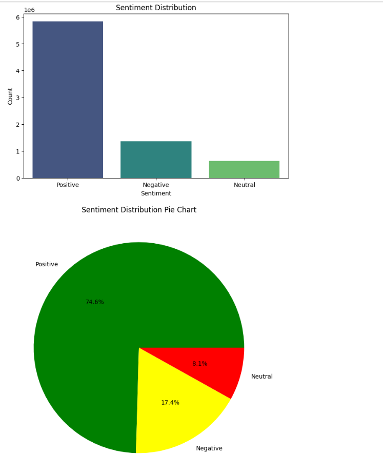
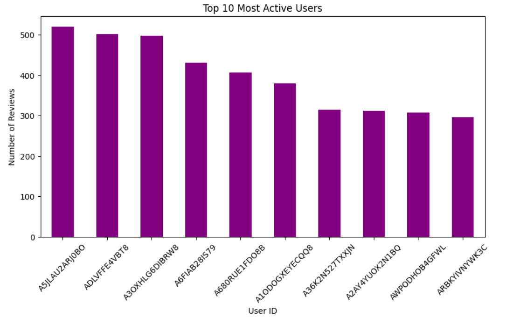
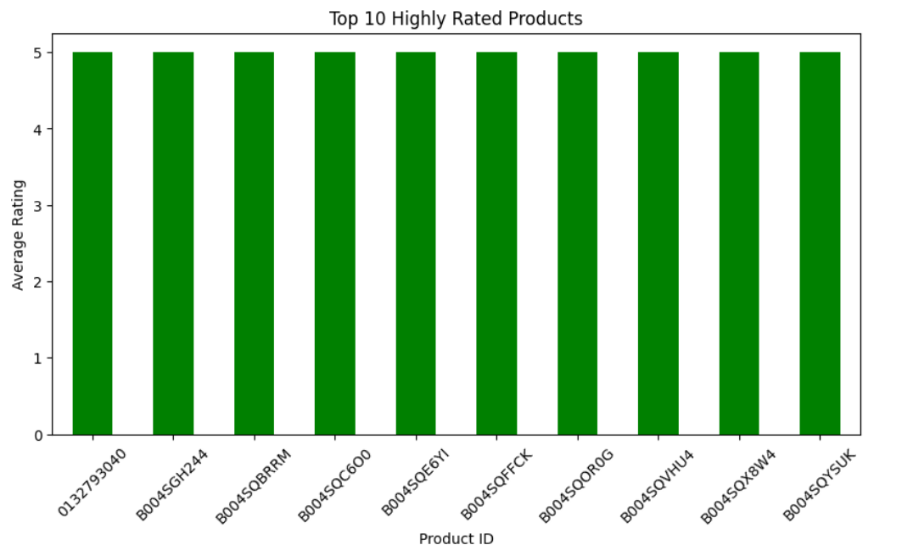
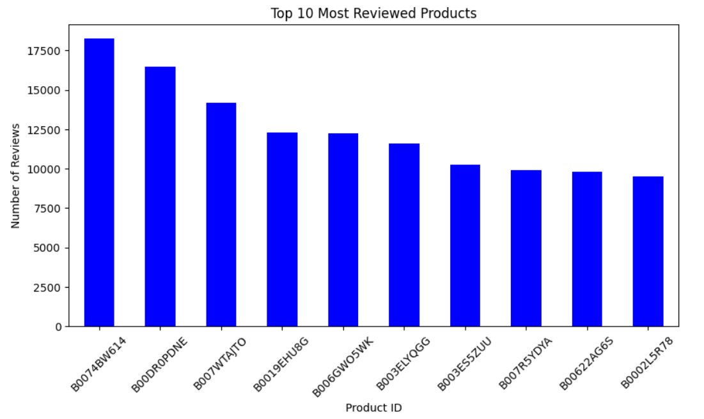
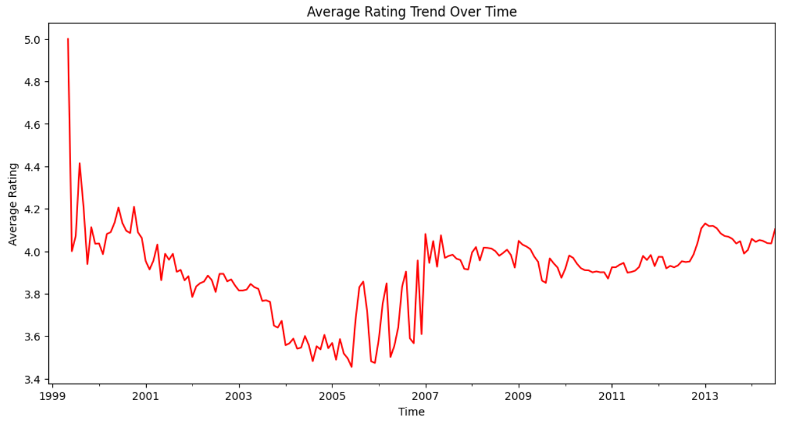

# Sentiment Analysis on Amazon Electronics Reviews

## 📌 Project Overview
This project aims to perform **sentiment analysis** on Amazon's **Electronics** product reviews dataset. The goal is to classify reviews into **Positive, Neutral, or Negative** sentiments based on ratings. Additionally, we explore valuable insights like the most reviewed products, the most active users, and rating trends over time.

## 📊 Dataset Details
- **Source:** [Amazon Reviews Dataset - Kaggle](http://jmcauley.ucsd.edu/data/amazon/)
- **Dataset Used:** Electronics reviews dataset
- **Attributes:**
  - `userId` : Unique identifier for users
  - `productId` : Unique identifier for products
  - `rating` : User rating for a product (1 to 5)
  - `timestamp` : Date and time of the rating

## 🛠️ Technologies Used
- Python
- Pandas
- Matplotlib
- Seaborn
- Jupyter Notebook

## 📌 Methodology
1. **Data Preprocessing:**
   - Load and clean the dataset
   - Convert timestamps into readable date format
   - Handle missing values
   
2. **Sentiment Categorization:**
   - Ratings **≥ 4** → **Positive**
   - Ratings **= 3** → **Neutral**
   - Ratings **≤ 2** → **Negative**
   
3. **Data Visualization & Insights:**
   - **Sentiment Distribution**: Shows the count of positive, neutral, and negative reviews.
   - **Top 10 Most Rated Products**: Identifies the most highly rated products.
   - **Top 10 Most Reviewed Products**: Highlights products with the most reviews.
   - **Top 10 Most Active Users**: Finds users who left the most reviews.
   - **Average Rating Over Time**: Displays trends in ratings over different time periods.

## 📈 Visualizations
The project generates insightful charts to better understand customer reviews:







## 🚀 Running the Project
To run this project on your local machine:
1. Clone this repository:
   ```bash
   git clone https://github.com/Daniyal-DS/Sentiment-Analysis-on-Customer-Reviews
   ```
2. Install the required dependencies:
   ```bash
   pip install pandas matplotlib seaborn
   ```
3. Run the Jupyter Notebook or Python script.

## 📌 Results & Findings
- Majority of the reviews are **positive**, indicating customer satisfaction with electronics products.
- Certain products have significantly higher ratings compared to others.
- Some users are highly active, leaving a large number of reviews.
- Average rating trends show fluctuations over time.

## 🔗 References
- **Dataset:** [Amazon Reviews Dataset](http://jmcauley.ucsd.edu/data/amazon/)
- **Documentation & Libraries:** Pandas, Matplotlib, Seaborn

📢 *Feel free to contribute, report issues, or suggest improvements!* 🚀

